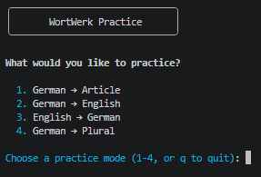
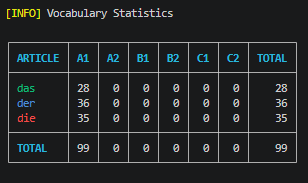
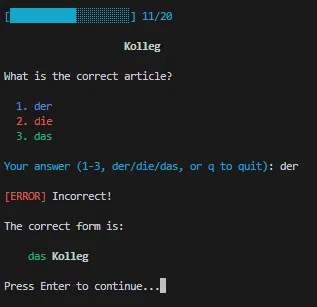
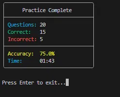

<div align="center">


# WortWerk

**A small CLI tool for practicing German vocabulary, articles, translations, and plurals.**

*WortWerk is a personal project I'm building alongside my journey of learning German. The goal is to create a simple tool that I can actually use while learning.*

</div>
<br>

## 📊 Current Vocabulary

The current WortWerk vocabulary dataset is organized by German article and CEFR level:

| Article | A1 | A2 | B1 | B2 | C1 | C2 | Total |
| :------ | --: | --: | --: | --: | --: | --: | ----: |
| der     | 67 | 0 | 0 | 0 | 0 | 0 | 67 |
| die     | 92 | 0 | 0 | 0 | 0 | 0 | 92 |
| das     | 93 | 0 | 0 | 0 | 0 | 0 | 93 |
| **Total** | **252** | **0** | **0** | **0** | **0** | **0** | **252** |

All the words are gathered from the **Starten Wir** book series.

> **Dataset snapshot:** August 2026
> The vocabulary dataset is continuously growing alongside my German-learning journey.
> Run `python -m scripts.wortwerk stats` to view the current statistics.

## ✨ Features

### 📚 Vocabulary Management
Add, edit, delete, and search vocabulary. Filter by article or CEFR level, sort by ID/alphabetical order/level (with reverse option), and view overall vocabulary statistics.

### 📝 Practice Mode
Four practice modes:
- German → Article
- German → English
- English → German
- German → Plural

Before each session you can choose the number of words, the CEFR level(s), and whether a German article is required. Questions are randomized, with answer validation, per-question timing, session timing, accuracy tracking, and saving of both completed and unfinished sessions.

**Run it:**
```bash
python -m scripts.practice_mode
```

### 🎯 Quiz Mode
A more structured experience for combining multiple question types in one session.

- Predefined templates: **Short**, **Medium**, **Long**
- Custom quiz creation with a configurable number of questions per mode
- Randomized question selection and order
- CEFR level selection and optional article requirement
- Accuracy tracking, per-question timing, and completed/unfinished session tracking

**Run it:**
```bash
python -m scripts.practice_mode --quiz
```

### 💾 Reusable Quiz Templates
Custom quizzes can be saved as named, reusable templates with their own question distribution - useful for keeping separate configurations for different learning goals. Saved templates load instantly without recreating the setup, and are stored locally for future sessions.

Example:
```text
Grammar Focus
├── 10 × German → Article
├── 5 × English → German
└── 5 × German → Plural

Translation Practice
├── 10 × German → English
└── 10 × English → German
```

When launching quiz mode, you choose between:
```text
1. Short
2. Medium
3. Long
4. Custom
5. Saved templates
```

### 📈 Learning History
Practice and quiz results are recorded automatically to the `history/` directory, with a separate file per practice mode:

```text
history
├── article_practice_history.json
├── english_practice_history.json
├── german_practice_history.json
├── plural_practice_history.json
└── sessions.json
```

Each session records: date/time, session type, practice mode, selected CEFR levels, number of questions, correct/incorrect answers, accuracy, total answer time, and whether it was completed. Unfinished sessions are saved too. Per-word stats (attempts, correct, incorrect) are also tracked.

**Run it:**
```bash
python -m scripts.practice_mode --history
```

### 🎨 CLI Experience
Colored, interactive terminal interface with clear validation messages, interactive menus, and randomized questions.

## 🛠️ Requirements

- Python 3.10+
- SQLite (no external database server required)

## 📸 Screenshots

### Practice Mode

<div align="center">



</div>
</br>

### Vocabulary List

<div align="center">



</div>
</br>

### Wrong Answer

<div align="center">



</div>
</br>

### Session Summary

<div align="center">



</div>
</br>

## 📦 Installation

```bash
git clone https://github.com/AmirmasoudCS/WortWerk.git
cd WortWerk
```

Create and activate a virtual environment:

```bash
python -m venv .venv
```

**Windows:**
```bash
.venv\Scripts\activate
```

**Linux / macOS:**
```bash
source .venv/bin/activate
```

Install dependencies:

```bash
pip install -r requirements.txt
```

## 🚀 Getting Started

See all available commands and options:

```bash
python -m scripts.wortwerk -h
```

### Vocabulary Commands

| Command                     | Alias                   | Functionality                              |
| :-------------------------- | :---------------------- | :----------------------------------------- |
| `--help`                    | `-h`                    | Show help messages                         |
| `init`                      | -                       | Initialize the database                    |
| `add`                       | -                       | Add a new word                             |
| `list`                      | -                       | List vocabulary                            |
| `list --help`               | `list -h`               | Show help for the list command             |
| `list --article <article>`  | `list -art <article>`   | Filter by article                          |
| `list --level <level>`      | `list -lev <level>`     | Filter by level                            |
| `list --sort <method>`      | `list -s <method>`      | Sort by ID, alphabetical order, or level   |
| `list --reverse`            | `list -rev`             | Reverse the sort order                     |
| `delete <id>`               | -                       | Delete a word by ID                        |
| `edit <id>`                 | -                       | Edit a word by ID                          |
| `stats`                     | -                       | Show vocabulary statistics                 |
| `search <query>`            | -                       | Search for a word or translation           |

### Practice Mode Commands

| Command                     | Alias                  | Functionality                              |
| :-------------------------- | :--------------------- | :----------------------------------------- |
| `--help`                    | `-h`                   | Show help message                          |
| `--quiz`                    | `-q`                   | Launch quiz mode                           |
| `--history`                 | `-H`                   | Show practice history                      |
| `--weak`                    | `-w`                   | Practice your weakest words                |
| `--show-weak`               | `-sw`                  | Show your weakest words                    |
| `--show-progress`           | `-sp`                  | Show accuracy progress over time           |
| `--save`                    | `-s`                   | Save the progress chart created with `-sp` |


Example:
```bash
python -m scripts.wortwerk list --sort alphabetical
```

> For Practice Mode, Quiz Mode, templates, and history details, see the [Features](#-features) section above.

## 🤝 Contributing

WortWerk is a personal learning project, but contributions and suggestions are welcome. See [CONTRIBUTING.md](./CONTRIBUTING.md).

## ⚖️ License

MIT License - see [LICENSE](./LICENSE) for the full text.

## 📌 Project Status

WortWerk is an ongoing personal project that will evolve alongside my German-learning journey.

[🛣️ Roadmap](./roadmap.md)